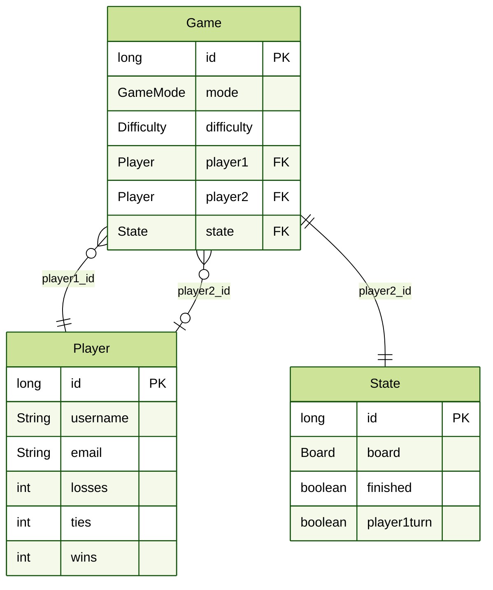

# Checkers Game

## Entity Relationship Diagram

```mermaid
%%{init: {'theme':'forest'}}%%
erDiagram
    Game }o--|| Player : player1_id
    Game }o--o| Player : player2_id
    Game ||--|| State : player2_id
    Game {
       long id PK
       GameMode mode
       Difficulty difficulty
       Player player1 FK
       Player player2 FK
       State state FK
    }
    
    Player {
       long id PK
       String username
       String email
       int losses
       int ties
       int wins
    }
    
    State {
       long id PK
       Board board
       boolean finished
       boolean player1turn
    }
```

##